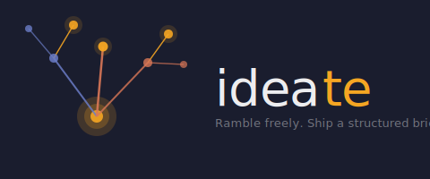
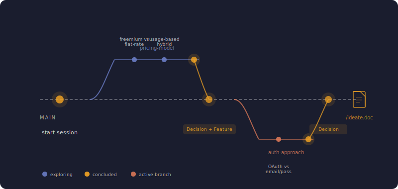
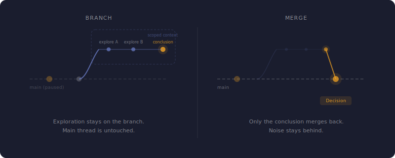

<p align="center">
  
</p>

<p align="center">
  <strong>Branch your thinking. Merge what matters.</strong>
</p>

<p align="center">
  <a href="LICENSE"></a>
  
  
</p>

---

Ideate is a [Claude Code](https://claude.ai/code) plugin for the messy, early phase of software projects. Describe your idea conversationally — ramble, pivot, contradict yourself — while Ideate tracks your thinking with git-like branching, extracts structured artifacts, and produces a document you can actually hand off.

<p align="center">
  
</p>

## Install

```bash
claude plugin add ideate
```

Then navigate to any project directory and run `/ideate`.

## See It In Action

```
You:  I want to build a payments platform for small businesses

  Ideate: Got it. I've started a session for "Payments Platform."
  What kind of businesses are you targeting?

You:  Mostly restaurants and retail. But I'm torn on the pricing model —
      should it be freemium or flat monthly?

  Ideate: That's worth exploring. I'll branch into "pricing-model" so we
  can think through this without losing the main thread.

  [branch: pricing-model]

You:  Freemium makes sense for acquisition, but flat-rate is simpler...
      actually, what if we do freemium with usage-based pricing above
      a threshold?

  Ideate: That's a strong hybrid. I'm extracting this as a decision:
  ✓ Decision — "Freemium with usage-based pricing"
  Ready to merge this back?

You:  Yeah, merge it.

  Ideate: Merged. I also noticed a feature forming — extracting:
  ✓ Feature — "Tiered pricing engine"
  Back on main. What about authentication?
```

No special syntax. No forms. Just talk — Ideate handles the structure.

## How Context Works

Ideation eats context. You explore a pricing tangent for 20 messages, then switch to auth — and now your conversation is buried under details that don't matter anymore. The deeper you go, the less room you have to think.

Ideate solves this with branching. When you branch, the exploration happens in its own scoped context. The main thread stays exactly where you left it — clean, uncluttered. When you merge, only the conclusion carries back. The 20 messages of back-and-forth that got you there stay behind. You return to a fresh context with just the decision, ready to move on.

<p align="center">
  
</p>

## Artifact Extraction

As ideas solidify, Ideate pulls them into typed artifacts:

- **Feature** — what the product does
- **Decision** — what was decided and why
- **Constraint** — technical or business limits
- **Persona** — who uses this
- **Goal** — what success looks like
- **Module** — functional subsystems

Artifacts live as individual markdown files in `.ideate/artifacts/` — human-readable, diffable, always reflecting the latest state.

## Commands

| Command | Purpose |
|---|---|
| `/ideate` | Start or resume a session |
| `/ideate.branch <name>` | Create or switch branches |
| `/ideate.merge` | Merge current branch to main |
| `/ideate.doc` | Generate the session document |
| `/ideate.research <topic>` | Research similar products and prior art |

Most of the time you won't need these — Ideate detects intent conversationally.

## Session Data

All state lives in `.ideate/` as plain markdown.

```
.ideate/
  session.md        — session metadata
  main.md           — merged conclusions
  branches/         — branch history (append-only)
  artifacts/        — extracted artifacts (mutable, always current)
  output/           — generated documents
```

## Why This Exists

The gap between "I have an idea" and "here's a document someone else can act on" is where most projects lose momentum. You either skip straight to building and discover missing requirements later, or spend days writing specs nobody reads.

Ideate fills that gap. Think out loud. Walk away with a structured brief.

## Documentation

- [Getting Started](docs/getting-started.md)
- [Concepts](docs/concepts.md) — branching, artifacts, session lifecycle
- [Skills Reference](docs/skills-reference.md) — detailed command docs
- [Example: Payments Platform](docs/examples/payments-platform.md) — full walkthrough

## Contributing

Ideate is open source under the MIT License. See [CLAUDE.md](CLAUDE.md) for development guidelines.

## License

MIT
